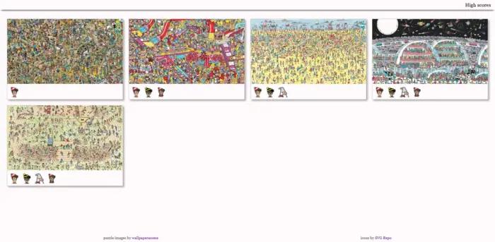
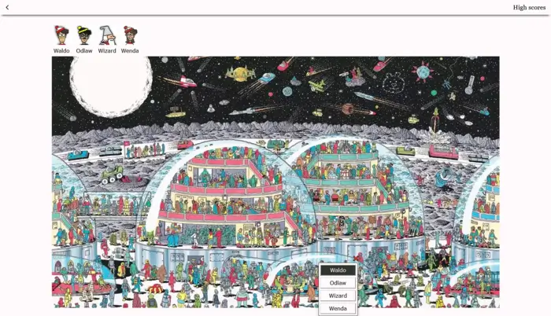

# Where's Waldo?

This is a basic implementation of [where's waldo](https://en.wikipedia.org/wiki/Where's_Wally%3F) built using React.The objective of the game is to locate Waldo and other characters within a given scene.

[Live site](https://how-is-waldo.netlify.app/)

## Features

- Multiple puzzles
- Saved high scores

## Screenshots

